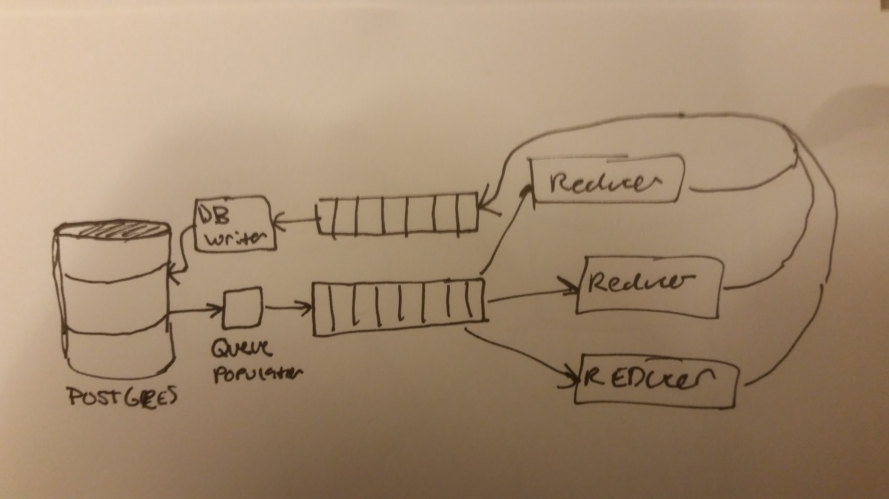

# Fast Reduce

In order to use train TensorFlow models we must obtain reductions of the
training data. Training data is usually in the form of strings, such as a
sentence or fragment.  For example, in order to train a model that detects
participle phrase fragments it might be useful to transform the sentence into
its parts of speech, then break the sentence into trigrams.

```python
"Struggling with the stream, he passed under the window of the storeroom, and
came across the line of Peegwish with his tail."
```

might become

```python
['VBG>IN>DT', 'IN>DT>NN', 'DT>NN>,', 'NN>,>PRP', ',>PRP>VBD', 'PRP>VBD>IN',
'VBD>IN>DT', 'IN>DT>NN', 'DT>NN>IN', 'NN>IN>DT', 'IN>DT>NN', 'DT>NN>,',
'NN>,>CC', ',>CC>VBD', 'CC>VBD>IN', 'VBD>IN>DT', 'IN>DT>NN', 'DT>NN>IN',
'NN>IN>NNP', 'IN>NNP>IN', 'NNP>IN>PRP$', 'IN>PRP$>NN', 'PRP$>NN>.']
```

By reducing a large number of sentences and participle phrases, we begin to
expose patterns that our tensorflow models can use to their advantage.  It may
be that the trigram `VBG>IN>DT` is correlated with a participle prhase fragment,
but that `,>PRP>VBD` suggests it is not.  This is not for us to figure out, but
the job of tensorflow. What we must do is,

  1. Reduce the strings
  2. Make it possible to order the reductions by number of occurrences

When these two things are done, it will be possible to vectorize strings, and
then train the models using those vectors and the string labels.

The process of string vectorization could also be distributed, but the reduction
must be completely finished first.  A distributed vectorizer would have very
similar architecture to this distributed reducer.


## Architecture

Fast Reduce structure looks something like,



In this model an arbitrary number of reducers read from a queue of strings, then
add reduced versions of those strings to a queue that writes to the database.
Many reducers are allowed, but only a single instance of the db writer and queue
populator are allowed.


## Usage

The boxes could be hosted on digital ocean. Because of the high cost of keeping
4 or more digital ocean droplets operable for long periods of time, I recommend
writing an ansible script to provision the reducer boxes. When the reducers are
done working, those droplets can be destroyed.


Right now, a single beefy digital ocean droplet hosts all of fast reduce.
